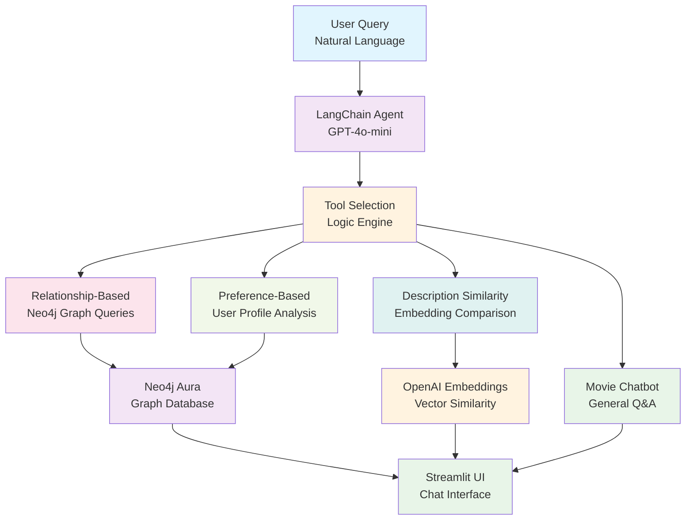
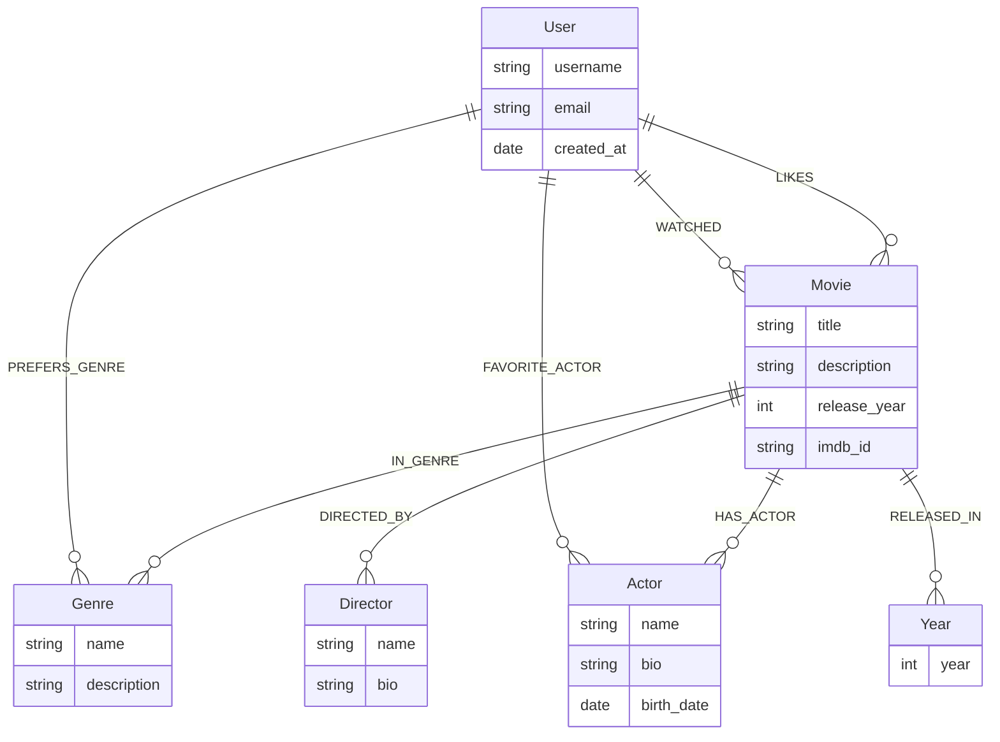

# Netflix Recommender Chatbot - Neo4j + LangChain + Streamlit

> **Conversational movie recommendations** using graph-based relationships and LLM-powered query generation with 4 specialized tools for intelligent movie discovery.

---

## 🎯 Problem Statement

Traditional recommendation systems often rely on collaborative filtering or content-based approaches that lack **contextual understanding** and **conversational interaction**. Users want natural language interactions that consider their preferences, watch history, and semantic movie similarities.

This project solves these challenges by combining:
- **Graph database relationships** for complex movie connections
- **LLM-generated Cypher queries** for natural language to database translation
- **Multi-tool agent architecture** for different recommendation strategies
- **Conversational interface** for intuitive user interaction

---

## 🏗️ Architecture Overview



---

## 🛠️ Technology Stack

| Component | Technology | Purpose |
|-----------|------------|---------|
| **Graph Database** | Neo4j Aura | Store movie relationships and user preferences |
| **LLM Framework** | LangChain | Agent framework and tool orchestration |
| **Language Model** | OpenAI GPT-4o-mini | Query generation and conversational responses |
| **Web Interface** | Streamlit | Chat interface and user interaction |
| **Embeddings** | OpenAI Text Embeddings | Semantic similarity calculations |
| **Query Language** | Cypher | Graph database queries generated by LLM |

---

## 🤖 Agent Architecture

### 4 Specialized Tools

1. **🎬 Movie Chatbot**
   - General movie knowledge and trivia
   - Natural language movie discussions
   - Context-aware responses about cinema

2. **🔗 Relationship-Based Recommendations**
   - Explores graph connections (actors, genres, directors)
   - "Movies like X because they share Y"
   - LLM generates Cypher queries dynamically

3. **👤 Preference-Based Recommendations**
   - Personalized suggestions based on user profile
   - Considers: liked movies, preferred genres, favorite actors
   - Avoids already-watched movies

4. **📝 Description Similarity**
   - Vector embeddings of movie descriptions
   - Cosine similarity for thematic matches
   - Finds movies with similar plots/themes

---

## 🚀 Quick Start

### Prerequisites
- Python 3.8+
- Neo4j Aura account (free tier available)
- OpenAI API key

### Setup Instructions

1. **Clone Repository**
   ```bash
   git clone https://github.com/grzegorz-gomza/Recommender_System_with_Neo4j.git
   cd Recommender_System_with_Neo4j
   ```

2. **Install Dependencies**
   ```bash
   pip install -r requirements.txt
   ```

3. **Configure Environment**
   
   Create `.streamlit/secrets.toml`:
   ```toml
   NEO4J_URI="neo4j+s://your-db-id.databases.neo4j.io"
   NEO4J_USERNAME="neo4j"
   NEO4J_PASSWORD="your-password"
   AURA_INSTANCEID="your-instance-id"
   AURA_INSTANCENAME="your-instance-name"
   
   OPENAI_API_KEY="your-openai-key"
   OPENAI_MODEL="gpt-4o-mini"
   ```

4. **Setup Neo4j Database**
   
   **Option A: Use provided notebook**
   ```bash
   jupyter notebook src/database/create_netflix_db.ipynb
   # Run all cells to populate database
   ```
   
   **Option B: Manual setup**
   - Connect to Neo4j Aura
   - Import movie dataset
   - Create relationships between movies, actors, genres

5. **Launch Application**
   ```bash
   streamlit run streamlit_app.py
   # Opens at http://localhost:8501
   ```

---

## 📊 Database Schema



---

## 💡 Example Interactions

### Relationship-Based
```
User: "Show me movies with the same cast as The Matrix"
Agent: Generates Cypher query → Finds movies with Keanu Reeves, Laurence Fishburne
```

### Preference-Based  
```
User: "I like sci-fi movies and I loved Inception"
Agent: Checks user profile → Recommends Interstellar, Blade Runner 2049
```

### Description Similarity
```
User: "Find movies similar to The Dark Knight"
Agent: Embeds description → Finds movies with similar themes → Recommends Se7en, The Prestige
```

---

## 🌐 Deployment

### Streamlit Cloud (Recommended)
1. Connect GitHub repository to Streamlit Cloud
2. Configure secrets in Streamlit dashboard
3. Deploy automatically on every push

### Local Production
```bash
# For production deployment
streamlit run streamlit_app.py --server.port 8501 --server.address 0.0.0.0
```

---

## 💼 Why This Matters for Employers

This project demonstrates **advanced AI engineering capabilities**:

1. **Graph Database Expertise**: Neo4j relationship modeling and Cypher optimization
2. **LLM Integration**: Dynamic query generation and prompt engineering
3. **Agent Architecture**: Multi-tool systems with intelligent tool selection
4. **Vector Operations**: Embeddings and similarity calculations
5. **Full-Stack AI**: Database → LLM → User interface pipeline
6. **Production Deployment**: Cloud hosting and configuration management

**Relevant for roles**: AI Engineer, ML Engineer, Backend Engineer (AI), Full-Stack AI Developer

---

## 🔮 Future Roadmap

- [ ] **Hybrid Recommendations**: Combine collaborative filtering with graph-based approaches
- [ ] **Real-time Updates**: Dynamic user preference learning
- [ ] **Movie Poster Integration**: Visual similarity using computer vision
- [ ] **Sentiment Analysis**: User review integration for recommendations
- [ ] **Multi-language Support**: International movie recommendations
- [ ] **API Development**: RESTful API for third-party integrations

---

## 📁 Repository Structure

```
├── src/
│   ├── database/
│   │   └── create_netflix_db.ipynb    # Database setup
│   └── agents/
│       ├── tools.py                   # Agent tool definitions
│       └── recommender_agent.py       # Main agent logic
├── streamlit_app.py                   # Web interface
├── requirements.txt                   # Dependencies
└── .streamlit/
    └── secrets.toml.example           # Configuration template
```

---

## 📄 License

MIT License
